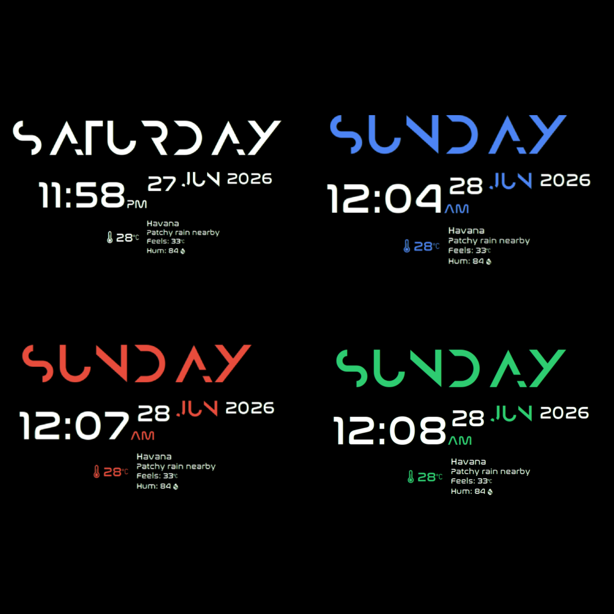

<div align="center">
  <h1>🌟 Mike TimeStats Conky</h1>
  <p><b>A sleek, highly customizable, and modern Conky widget featuring real-time weather, a stepped typographic layout, and a fully interactive terminal installer.</b></p>
  
  []()
  []()
  []()
</div>

---



## 📖 About The Project

Mike TimeStats Conky is a desktop monitoring widget designed to seamlessly blend into modern desktop environments. Moving away from cluttered system monitors, this widget focuses on providing essential time and weather data through clean typography and elegant iconography. 

To ensure the best user experience, it includes a robust interactive bash script. You don't need to manually edit Lua configuration files or deal with API keys—the installer handles everything from font deployment to setting your preferred language, color scheme, and temperature units.

## ✨ Features

- 🕒 **Modern Timekeeping**: 12-hour main clock format with an integrated AM/PM indicator.
- 📅 **Typographic Date Display**: Day, month, and year arranged in a visually appealing, stepped layout.
- 🌤️ **Zero-Config Weather**: Powered by `wttr.in`, weather data is fetched based on your IP address. No accounts or API keys required!
- 🌡️ **Detailed Metrics**: Displays current temperature, "feels like" temperature, and relative humidity percentage.
- 🌍 **Multilingual Out-of-the-Box**: Full localization support for English, Spanish, French, German, Italian, Portuguese, and Dutch.
- 🎨 **Dynamic Theming**: Choose from pure white or 8 different accent colors (Blue, Red, Green, Purple, Orange, Teal, Pink) to match your wallpaper.
- 🔄 **Selectable Units**: Choose between Celsius (°C) and Fahrenheit (°F).
- 🛠️ **Automated Setup**: The `install.sh` script automatically safely installs local fonts and configures all variables.

---

## 📦 Prerequisites

Before installing, ensure the following dependencies are present on your Linux distribution:

- **Conky** (v1.10+ is required as this widget uses the modern Lua syntax).
- **curl** (Required to fetch weather data from the web).
- **git** (To clone the repository).
- **fontconfig** (Provides the `fc-cache` command to load the newly installed fonts).

---

## 🚀 Installation Guide

> **⚠️ IMPORTANT NOTE:** The widget template file (`Mike_TimeStats`) uses placeholders (e.g., `__ACCENT_COLOR__`, `__LOCALE__`). **You must use the interactive terminal installer** to automatically parse these placeholders into a working Conky configuration.

### 1. Interactive Installation (Highly Recommended)

Open your terminal and run the following commands to configure and install the widget:

```bash
# 1. Clone the repository to your local machine
git clone [https://github.com/MikeDevQH/conky-widget-timestats.git](https://github.com/MikeDevQH/conky-widget-timestats.git)

# 2. Navigate into the cloned directory
cd conky-widget-timestats

# 3. Make the installer script executable
chmod +x install.sh

# 4. Run the installer
./install.sh
```

**During installation, the script will prompt you to:**
1. Select an accent color (Defaults to White / No accent).
2. Choose your preferred language (Defaults to English).
3. Select temperature units (Defaults to Celsius).

*The script will then securely install the required `.ttf` fonts to `~/.local/share/fonts/mike-timestats-conky/` and place the configured widget in `~/.config/conky/mike-timestats-conky/`.*

### 2. Manual Installation (For Advanced Users)

If you prefer to install the widget manually without the script, be aware that **the default style will be White text, English language, and Celsius (°C)**. Because the raw configuration file contains placeholders, you must manually replace them using `sed` or a text editor.

```bash
# 1. Install the fonts locally
mkdir -p ~/.local/share/fonts/mike-timestats-conky
cp fonts/*.ttf ~/.local/share/fonts/mike-timestats-conky/
fc-cache -f ~/.local/share/fonts/mike-timestats-conky/

# 2. Create the Conky configuration directory
mkdir -p ~/.config/conky/mike-timestats-conky
cp Mike_TimeStats ~/.config/conky/mike-timestats-conky/

# 3. Manually replace the placeholders with default English/Celsius values
cd ~/.config/conky/mike-timestats-conky/
sed -i "s|__ACCENT_COLOR__||g" Mike_TimeStats
sed -i "s|__LOCALE__|en_US.UTF-8|g" Mike_TimeStats
sed -i "s|__LANG_CODE__|en|g" Mike_TimeStats
sed -i "s|__UNIT_MODE__|m|g" Mike_TimeStats
sed -i "s|__UNIT_ICON__||g" Mike_TimeStats
sed -i "s|__LBL_FEELS__|Feels:|g" Mike_TimeStats
sed -i "s|__LBL_HUM__|Hum:|g" Mike_TimeStats
```

---

## 💻 Usage & Autostart

Once installed (either interactively or manually), you can launch the widget from your terminal to test it:

```bash
conky -c ~/.config/conky/mike-timestats-conky/Mike_TimeStats
```

### Starting automatically on boot

To ensure the widget loads every time you boot into your desktop environment, add it to your system's autostart applications. 

Depending on your Desktop Environment (KDE Plasma, GNOME, XFCE, etc.), you can usually find an "Autostart" or "Startup Applications" settings menu. Add a new entry with the following command:

```bash
conky -c ~/.config/conky/mike-timestats-conky/Mike_TimeStats &
```
*(Note: The `&` at the end ensures the process runs in the background).*

---

## ✒️ Credits & Acknowledgments

- **Developer:** MikeDevQH (michaelqhdez@gmail.com)
- **Weather Icons:** Beautiful weather glyphs provided by [Weather Icons by Erik Flowers](https://github.com/erikflowers/weather-icons).
- **Typography:** 
  - *Nasalization* (Used for time, date numbers, and general text).
  - *Anurati* (Used for stylized day and month names).
- **Weather Data:** Powered by [wttr.in](https://wttr.in).

## 📄 License

This project is distributed under the **GPLv3 License**. You are free to use, modify, and distribute this software in accordance with the terms of the license. See the `LICENSE` file in the repository for more details.
